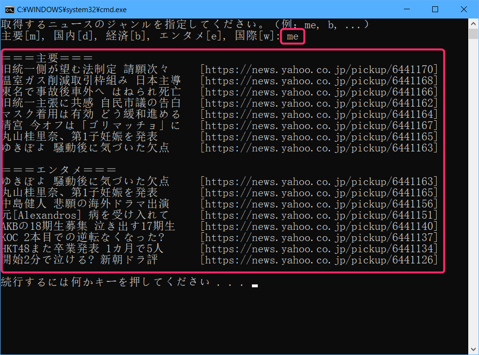

# zenn_autumn_nsn
"zenn"で公開している記事のソースコードをまとめたリポジトリです。

## Twitterのトレンドの起点を探るPythonのプログラム
[https://zenn.dev/autumn_nsn/articles/22be6dc5396453](https://zenn.dev/autumn_nsn/articles/22be6dc5396453)

Twitterのトレンドの起点を探るPythonのプログラムです。
直近の７日間くらいで、「#○○○○○」のようなハッシュタグを最初にツイートしたユーザーをドリルダウン形式で調べることができます。

## PythonでYahooニュースをWebスクレイピングする
[https://zenn.dev/autumn_nsn/articles/298f579784305a](https://zenn.dev/autumn_nsn/articles/298f579784305a)

Yahooニュースのカテゴリー別の記事のヘッドラインを取得するプログラムです。
最新版では、取得するカテゴリーを選択できるようになりました。

## 開発者について
ハンドルネーム：オータム西野  
"zenn"のサイトのページ：[https://zenn.dev/autumn_nsn](https://zenn.dev/autumn_nsn)  
  
以上
